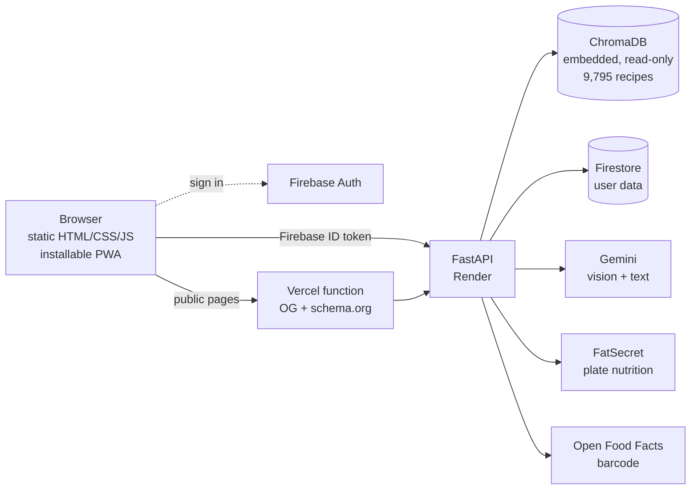

# Recipe RAG Assistant

[](https://github.com/gokdeniznarin/recipe-rag-assistant/actions/workflows/tests.yml)

A recipe assistant built on retrieval-augmented generation. Describe what you
feel like eating, photograph what is in your fridge, or search from the
ingredients you already own — the app retrieves matching recipes by semantic
similarity and explains why they fit.

**Live:** [recipe-rag-assistant.vercel.app](https://recipe-rag-assistant.vercel.app)
· API on Render · built as a university internship project.

---

## What it does

| | |
|---|---|
| **Search** | Free-text, semantic. Dietary and time constraints are parsed out of the sentence and applied as metadata filters. |
| **Camera search** | Photograph ingredients; vision identifies them and they become the query. |
| **Pantry** | Save what you own. Results are re-ranked by how much of your pantry they use, and each card shows the match count. |
| **Meal plan** | A weekly grid. Its real purpose is making the shopping list computable. |
| **Shopping list** | Derived, never stored: *planned recipes' ingredients − pantry*. Cannot go stale. |
| **Collections** | Named subsets of your saved recipes. |
| **Similar recipes** | On every recipe page, from the vector already stored for that recipe — no re-embedding, so ~5ms instead of ~300ms. |
| **Nutrition from a photo** | Photograph a plate for approximate macros, looked up in a nutrition database with the portion estimated from the photo. |
| **Barcode scan** | For packaged food, read the barcode and use the manufacturer's own declared values — no estimating at all. |
| **Public recipe pages** | Recipes open without an account, server-rendered with OG and schema.org tags, plus curated collections under `/discover`. |
| **Installable** | A PWA: installs to the home screen on Android and iOS with no store involved. |

## Architecture



Two data stores with strictly separate jobs. **ChromaDB** holds the recipes:
read-only, written once by the ingestion pipeline and baked into the Docker
image, so semantic search and metadata filtering happen in the same place with
no database server to run. **Firestore** holds everything that changes at
runtime — favourites, collections, pantry, meal plans, shopping-list overlays.

The backend is therefore **stateless**: one container, no persistent disk,
which is what made a free-tier deployment possible at all.

The two nutrition providers are not redundancy, they answer different questions:
FatSecret is asked *"what is 100g of grilled chicken?"*, Open Food Facts is asked
*"what is **this package**?"* — its primary key is the barcode itself.

**Stack:** FastAPI · ChromaDB (`all-MiniLM-L6-v2` via ONNX) · Firebase Auth ·
Firestore · Google Gemini · plain HTML/CSS/JS frontend · Docker.

### Offline and installability

The service worker caches the app shell only, and **never an API response** —
enforced by two independent guards, both tested. Cache Storage is per-origin,
persistent and survives sign-out, so favourites, pantry and plans living there
would leak between accounts on a shared computer. The cost is honest: offline,
the app opens and navigates, but searching says it cannot reach the server.

Caching is network-first rather than cache-first. Filenames carry no hash and
every script is a global `<script>`, so a cache-first worker could serve new HTML
with stale JS and produce a silent `ReferenceError`. The speed given up is
irrelevant next to the measured 6s embedding step.

## Engineering decisions worth reading

Each of these was driven by a measurement rather than a preference.

**Search does not wait for the LLM.** Recipes come back from ChromaDB in ~0.3s
but the endpoint used to block on Gemini, so users stared at a spinner for 8.9s
while the results already existed. Commentary moved to a separate request:
**8.87s → 0.32s**. The AI box fills in afterwards, and if the quota is gone the
box simply never appears.

**PyTorch removed.** The image was 2.83GB, of which 750MB was torch, pulled in
by a single line of `sentence-transformers`. ChromaDB's default embedding
function runs the *same* model on ONNX, which was already installed. Verified
before switching: identical top-5 results across 12 queries, largest vector
difference 2.35e-07. **2.83GB → 1.14GB**, memory at startup 568MB → 123MB.

**A distance threshold was measured and rejected.** To detect nonsense queries,
vector distance looked obvious. Calibrating across 55 queries showed the classes
overlap: real queries like `borscht` (1.141) and `dinner` (1.185) sit *further*
away than keyboard mashing like `zxcvbnm` (1.240). No threshold separates them,
so the job went to a cheap LLM classifier instead.

**Quota is per model, so the model list is a chain.** The free tier allows 20
requests per model per day. Depending on one model means every LLM feature dies
after 20 requests, so requests fall through a list, skipping any model that
reports 429, 404, 503 or times out. Text and vision start at *different* models
on purpose, so neither burns the other's fresh pool.

**OAuth 1.0, not 2.0, for nutrition data.** FatSecret's OAuth 2.0 requires
whitelisting a fixed IP, and Render's free tier has no static outbound address —
that route is simply closed. OAuth 1.0 signs each request instead, so no IP lock
is needed. Signing is `hmac`/`hashlib`/`urllib`; no new dependency.

**A mocked test cannot verify someone else's contract.** Barcode lookup was
written against FatSecret and had 72 passing tests. The first live call returned
`error 10: Unknown method` — that endpoint is Premier-only. What made the
diagnosis conclusive was a control group in the same run: `foods.search` and
`food.get.v4` answered with the same credentials, so signing and identity were
fine and only the entitlement was missing. The feature moved to Open Food Facts,
which is barcode-native, keyless, and measured **faster** (215–254ms vs 515ms).

**A wrong barcode is worse than no barcode.** When the browser has no barcode
detector the digits are read by OCR, and a single misread digit does not fail
harmlessly — it can resolve to a *different real product*, shown under the label
"from the manufacturer". So the GTIN check digit is verified before any network
call. Misreads become "unreadable", never someone else's food.

**Never publish a machine-readable claim you cannot defend.** The public recipe
pages deliberately omit `suitableForDiet` and `nutrition` from their schema.org
markup: the dietary tags are rule-based guesses, and the calorie column has a
long broken tail (median 309 kcal, maximum 38,662). Inside the app those numbers
appear beside a "guess" label; structured data has nowhere to put that caveat,
and a crawler would restate it as fact. Both omissions are pinned by tests.

**Fail-open everywhere.** No FatSecret key, an exhausted quota, a slow upstream —
none of it breaks a feature, it only changes where the numbers come from. The
response says which, and the UI repeats it, because a looked-up number and a
generated one are not the same claim. The barcode path is the one deliberate
exception: nothing can infer nutrition from a 13-digit number, it can only
invent it, so a miss returns nothing.

## Data

Kaggle's *Food.com Recipes and Reviews* (522,517 recipes). A random 10,000 were
sampled **from those that have a photo**, leaving **9,795** after cleaning.

Cleaning parses R-style vectors into lists, converts ISO-8601 durations to
minutes, and infers six dietary tags from ingredients, category *and* recipe
name — the last two act as a safety net when the ingredient list is incomplete.
The tags are **rule-based guesses and the interface says so**; `validate_tags.py`
checks them for contradictions.

Two tag errors were later found by auditing the real database rather than the
test suite, which uses synthetic recipes. **228 recipes tagged `vegetarian`
contained meat**, because the meat list was missing `ham`, `sausage`,
`prosciutto` and others; and recipes whose *name* announced nuts could still be
tagged `nut_free`, because the name safety net had only ever been wired up for
meat. Both are now zero in the live database.

The obvious fix for the first would have made things worse: plain substring
matching hits **graham** cracker in 101 desserts. Matching moved to whole words
instead, which incidentally fixed three errors nobody had noticed — `beefsteak
tomatoes` read as beef, `aceitunas` as tuna, `goat cheese` as oats — and cost
one that had to be handled explicitly, since `\bmeats?\b` no longer matches
`meatball`.

Ingredient *quantities* were deliberately left out: measured against 2,000
recipes, the ingredient and quantity arrays are aligned in only **27%** of cases
in the source data. Showing a wrong quantity is worse than showing none.

`RecipeServings` was ingested to settle whether calories are per serving or per
recipe. The measurement refuted the assumption behind the question: the raw
values are already per serving (72% land in 150–800 kcal, while dividing pushes
74% below 100 kcal), so the extreme values are data errors, not a mixed basis.

## Tests

```bash
pip install -r api/requirements-dev.txt
python -m pytest                 # 852 tests, ~4s, no network or containers
node scripts/check_frontend.js   # JS syntax + HTML/JS element wiring
```

Seven browser-JS suites run beside pytest in CI — **284 checks** covering the
service worker, the camera module, the sign-in gate, the auth guard, SEO markup
and post-sign-in return intent. They need no framework: each builds a fake DOM,
a fake clock or a fake Cache API and runs the real file.

Layered because the code is layered:

- **Layer 1 — pure functions**, no mocks: filter extraction, validation,
  ingredient matching, week arithmetic, macro scaling, OAuth signing.
- **Layer 1.5 — fake HTTP/Firestore**: full lookup chains and document writes
  without touching a network.
- **Layer 2 — HTTP contracts**: auth, CORS, error shapes, and *which
  dependencies must not be touched* — for example that the nutrition endpoint
  never queries ChromaDB.

Some tests are written against **independent** vectors rather than our own
output, because self-checking would be circular. The OAuth signature is verified
against Twitter's published OAuth 1.0a example — and a wrong signature would
otherwise fail *silently* into the fallback and never be noticed. The GTIN check
digit is verified against published EAN-13, UPC-A and EAN-8 barcodes.

Account deletion is guarded by a test that walks the **syntax tree** of every
`api/*.py` file, collects each Firestore collection touched anywhere in the code
and compares it with the deletion scope. Forgetting to add a new collection
would not raise anything: the user would be told their account was erased while
their data quietly remained.

## Running locally

```bash
cp .env.example .env      # then fill in the keys below
docker compose up -d --build
```

Frontend on `localhost:3000`, API on `localhost:8080`.

| Variable | Required | Purpose |
|---|---|---|
| `GEMINI_API_KEY` | yes | Text generation and vision |
| `FIREBASE_CREDENTIALS_JSON` | in production | Service-account JSON as text. Locally a mounted `api/firebase-key.json` is used instead. |
| `FATSECRET_CONSUMER_KEY` / `_SECRET` | no | Plate nutrition lookups. Without them the feature still works from the model's estimate. |
| `INTERNAL_API_KEY` | in production | Lets the Vercel renderer skip the rate limit on the public recipe endpoint. Must match on both hosts. |

Barcode lookups need no key at all — Open Food Facts is open.

Secrets are gitignored and kept out of the image by `.dockerignore` — verified,
the built image contains neither.

Backend changes need `docker compose up -d --build api`, since the source is
copied into the image. The frontend is bind-mounted, so
`docker restart recipe_frontend` and a hard refresh are enough.

The app icon and the outline used on app pages are both generated from one
geometry file, so they cannot drift apart:

```bash
python scripts/make_icons.py     # writes frontend/icons/ (4 PNGs + 1 SVG)
```

> Re-running ingestion must happen **on Linux**: on Windows, ChromaDB writes the
> embeddings but never materialises the HNSW index files, and the database only
> fails when a *different* process opens it.

## Deployment

The root `Dockerfile` is used by both `docker compose` and Render, so "it built
locally" actually means something. The app listens on `$PORT`, defaulting to
8080. Frontend deploys separately to Vercel as static files plus two serverless
functions that server-render the public recipe and collection pages.

Both hosts track the same branch, so a push deploys both — not atomically, so a
short window can mix old and new. Both directions degrade gracefully rather than
breaking.

The free Render tier sleeps after 15 minutes of silence, and waking it was
measured at **42.6s** against **0.42s** warm, so an uptime monitor pings `/`
every five minutes. That needed a code change, not a settings change: monitors
default to `HEAD`, and FastAPI — unlike bare Starlette — does not add `HEAD` to a
`GET` route, so the probe answered `405` from the moment it was set up.

## Known limitations

Stated rather than hidden — most were found by measurement.

- **Search takes ~6s in production.** Measured: 99.5% of it is ONNX embedding on
  Render's 0.1 vCPU. The same query is 0.3s locally. This is the platform, not
  the code — `chromadb get` by id, which skips embedding, is 2.6ms on the same
  container. The keep-alive monitor does not help here; it removes the cold
  start, not the embedding.
- **Portion size in nutrition is inherently rough.** A photo cannot show whether
  a plate holds 100g or 300g, and oil, butter and sugar are invisible. Better
  data does not fix physical uncertainty. The barcode path removes it for
  packaged food only.
- **Nutrition databases index food as sold, dry.** Cooked barley is 123 kcal/100g
  and dry barley is 354; grains and pasta can be matched to the dry entry.
- **Barcode coverage is uneven outside global brands.** Measured on a phone with
  real products: three of four were found. Open Food Facts is community-edited,
  so a missing product can be added; a miss says so instead of guessing.
- **Dietary tags remain guesses.** The two errors above were fixed, but the
  method offers no guarantee. That is why the curated public collections cover
  *preferences* (vegetarian, vegan) and deliberately not *allergens*
  (gluten-free, nut-free): a wrong preference list is annoying, a wrong allergen
  list is a health risk, and a pinned collection title has nowhere to print the
  caveat the app itself shows.
- **Pantry search suggests, it does not guarantee.** Semantic search returns
  recipes *near* your pantry; set containment cannot be expressed as a vector
  query, so a result may still need something you lack.
- **Google sign-in uses a popup**, which in-app browsers (Instagram, LinkedIn)
  can block. Desktop, normal mobile browsers and the installed PWA all work —
  the last one was verified on a real device.
