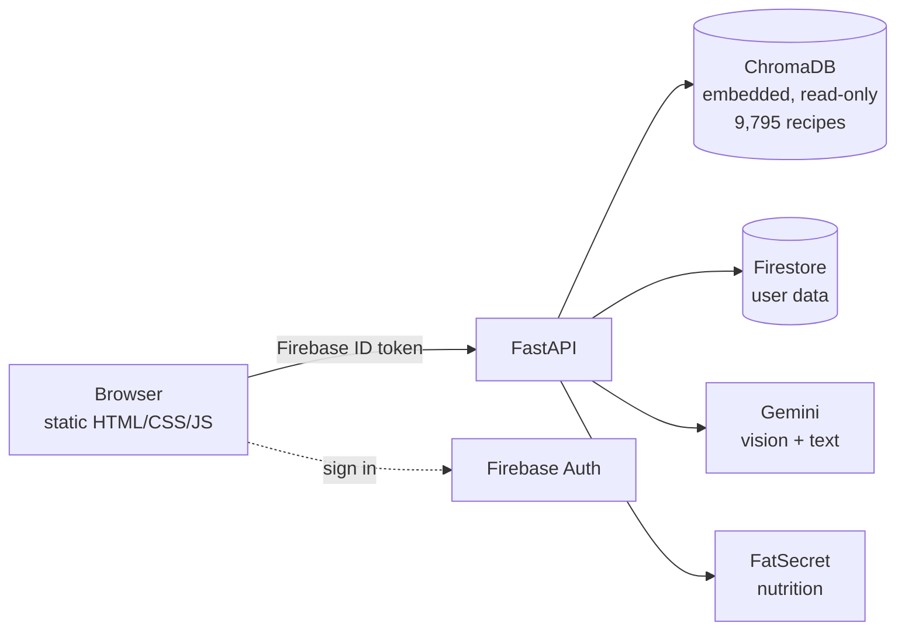

# Recipe RAG Assistant

[](https://github.com/gokdeniznarin/recipe-rag-assistant/actions/workflows/tests.yml)

A recipe assistant built on retrieval-augmented generation. Describe what you
feel like eating, photograph what is in your fridge, or search from the
ingredients you already own — the app retrieves matching recipes by semantic
similarity and explains why they fit.

**Live:** [recipe-rag-assistant.vercel.app](https://recipe-rag-assistant.vercel.app)
· API on Render · built as a university internship project.

---

## What it does

| | |
|---|---|
| **Search** | Free-text, semantic. Dietary and time constraints are parsed out of the sentence and applied as metadata filters. |
| **Camera search** | Photograph ingredients; vision identifies them and they become the query. |
| **Pantry** | Save what you own. Results are re-ranked by how much of your pantry they use, and each card shows the match count. |
| **Meal plan** | A weekly grid. Its real purpose is making the shopping list computable. |
| **Shopping list** | Derived, never stored: *planned recipes' ingredients − pantry*. Cannot go stale. |
| **Nutrition** | Photograph a plate for approximate macros, looked up in a nutrition database with the portion estimated from the photo. |
| **Collections** | Named subsets of your saved recipes. |

## Architecture



Two data stores with strictly separate jobs. **ChromaDB** holds the recipes:
read-only, written once by the ingestion pipeline and baked into the Docker
image, so semantic search and metadata filtering happen in the same place with
no database server to run. **Firestore** holds everything that changes at
runtime — favourites, collections, pantry, meal plans, shopping-list overlays.

The backend is therefore **stateless**: one container, no persistent disk,
which is what made a free-tier deployment possible at all.

**Stack:** FastAPI · ChromaDB (`all-MiniLM-L6-v2` via ONNX) · Firebase Auth ·
Firestore · Google Gemini · plain HTML/CSS/JS frontend · Docker.

## Engineering decisions worth reading

Each of these was driven by a measurement rather than a preference.

**Search does not wait for the LLM.** Recipes come back from ChromaDB in ~0.3s
but the endpoint used to block on Gemini, so users stared at a spinner for 8.9s
while the results already existed. Commentary moved to a separate request:
**8.87s → 0.32s**. The AI box fills in afterwards, and if the quota is gone the
box simply never appears.

**PyTorch removed.** The image was 2.83GB, of which 750MB was torch, pulled in
by a single line of `sentence-transformers`. ChromaDB's default embedding
function runs the *same* model on ONNX, which was already installed. Verified
before switching: identical top-5 results across 12 queries, largest vector
difference 2.35e-07. **2.83GB → 1.14GB**, memory at startup 568MB → 123MB.

**A distance threshold was measured and rejected.** To detect nonsense queries,
vector distance looked obvious. Calibrating across 55 queries showed the classes
overlap: real queries like `borscht` (1.141) and `dinner` (1.185) sit *further*
away than keyboard mashing like `zxcvbnm` (1.240). No threshold separates them,
so the job went to a cheap LLM classifier instead.

**Quota is per model, so the model list is a chain.** The free tier allows 20
requests per model per day. Depending on one model means every LLM feature dies
after 20 requests, so requests fall through a list, skipping any model that
reports 429, 404, 503 or times out. Text and vision start at *different* models
on purpose, so neither burns the other's fresh pool.

**OAuth 1.0, not 2.0, for nutrition data.** FatSecret's OAuth 2.0 requires
whitelisting a fixed IP, and Render's free tier has no static outbound address —
that route is simply closed. OAuth 1.0 signs each request instead, so no IP lock
is needed. Signing is `hmac`/`hashlib`/`urllib`; no new dependency.

**Fail-open everywhere.** No FatSecret key, an exhausted quota, a slow upstream —
none of it breaks a feature, it only changes where the numbers come from. The
response says which, and the UI repeats it, because a looked-up number and a
generated one are not the same claim.

## Data

Kaggle's *Food.com Recipes and Reviews* (522,517 recipes). A random 10,000 were
sampled **from those that have a photo**, leaving **9,795** after cleaning.

Cleaning parses R-style vectors into lists, converts ISO-8601 durations to
minutes, and infers six dietary tags from ingredients, category *and* recipe
name — the last two act as a safety net when the ingredient list is incomplete.
The tags are **rule-based guesses and the interface says so**; `validate_tags.py`
checks them for contradictions.

Ingredient *quantities* were deliberately left out: measured against 2,000
recipes, the ingredient and quantity arrays are aligned in only **27%** of cases
in the source data. Showing a wrong quantity is worse than showing none.

## Tests

```bash
pip install -r api/requirements-dev.txt
python -m pytest                 # 537 tests, ~3s, no network or containers
node scripts/check_frontend.js   # JS syntax + HTML/JS element wiring
```

Layered because the code is layered:

- **Layer 1 — pure functions**, no mocks: filter extraction, validation,
  ingredient matching, week arithmetic, macro scaling, OAuth signing.
- **Layer 1.5 — fake HTTP/Firestore**: full lookup chains and document writes
  without touching a network.
- **Layer 2 — HTTP contracts**: auth, CORS, error shapes, and *which
  dependencies must not be touched* — for example that the nutrition endpoint
  never queries ChromaDB.

The OAuth signature is checked against Twitter's published OAuth 1.0a vector
rather than our own HMAC, which would be circular — and a wrong signature would
otherwise fail *silently* into the fallback and never be noticed.

## Running locally

```bash
cp .env.example .env      # then fill in the keys below
docker compose up -d --build
```

Frontend on `localhost:3000`, API on `localhost:8080`.

| Variable | Required | Purpose |
|---|---|---|
| `GEMINI_API_KEY` | yes | Text generation and vision |
| `FIREBASE_CREDENTIALS_JSON` | in production | Service-account JSON as text. Locally a mounted `api/firebase-key.json` is used instead. |
| `FATSECRET_CONSUMER_KEY` / `_SECRET` | no | Nutrition lookups. Without them the feature still works from the model's estimate. |
| `INTERNAL_API_KEY` | in production | Lets the Vercel renderer skip the rate limit on the public recipe endpoint. Must match on both hosts. |

Secrets are gitignored and kept out of the image by `.dockerignore` — verified,
the built image contains neither.

Backend changes need `docker compose up -d --build api`, since the source is
copied into the image. The frontend is bind-mounted, so
`docker restart recipe_frontend` and a hard refresh are enough.

> Re-running ingestion must happen **on Linux**: on Windows, ChromaDB writes the
> embeddings but never materialises the HNSW index files, and the database only
> fails when a *different* process opens it.

## Deployment

The root `Dockerfile` is used by both `docker compose` and Render, so "it built
locally" actually means something. The app listens on `$PORT`, defaulting to
8080. Frontend deploys separately to Vercel as static files.

The free Render tier sleeps after 15 minutes; the first request afterwards takes
30–60s.

## Known limitations

Stated rather than hidden — most were found by measurement.

- **Search takes ~6s in production.** Measured: 99.5% of it is ONNX embedding on
  Render's 0.1 vCPU. The same query is 0.3s locally. This is the platform, not
  the code — `chromadb get` by id, which skips embedding, is 2.6ms on the same
  container.
- **Portion size in nutrition is inherently rough.** A photo cannot show whether
  a plate holds 100g or 300g, and oil, butter and sugar are invisible. Better
  data does not fix physical uncertainty.
- **Nutrition databases index food as sold, dry.** Cooked barley is 123 kcal/100g
  and dry barley is 354; grains and pasta can be matched to the dry entry.
- **Dietary tags are guesses.** One known gap: recipes whose *name* reveals nuts
  can still be tagged `nut_free`, since the name safety net was only wired up for
  meat. It is recorded as a deliberately failing test.
- **Pantry search suggests, it does not guarantee.** Semantic search returns
  recipes *near* your pantry; set containment cannot be expressed as a vector
  query, so a result may still need something you lack.
- **Google sign-in uses a popup**, which in-app browsers (Instagram, LinkedIn)
  can block. Desktop and normal mobile browsers work.
